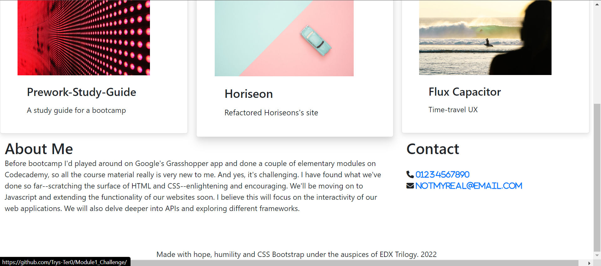

# Bootstrap-Portfolio

## Description 

A developer's portfolio is not just a showcase of their skills and projects; it is also an expression of their design ethos. The novice developer's ability to use the medium to effectively articulate that ethos is strongly tested by the freedom to do whatever they want with their site. Thankfully, I was tasked with creating a portfolio site using Bootstrap and including particular features such as a jumbotron with an image and hover effects on links.

## Installation

Simply enter the URL into a browser or click the link: https://trys-ter0.github.io/Bootstrap-Portfolio/

## Usage 

Click links in the navbar to navigate the page. Click the cards in the work section to navigate to the projects.

## Credits

I used WC3 materials.

## License

No license

---
